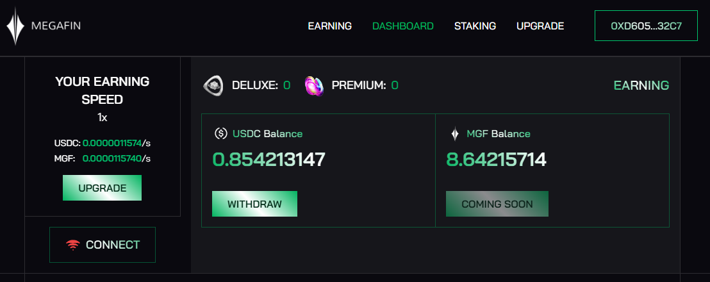
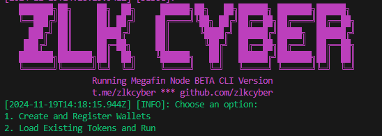

# MEGAFIN NETWORK
Earning by sharing internet bandthwith [https://app.megafin.xyz/dashboard](https://app.megafin.xyz/upgrade?ref=5d0f66f3)


## Features

- **Register New Wallets**: Create multiple Ethereum wallets and register them on the Megafin platform.
- **Load Existing Tokens**: Load pre-existing tokens and verify their validity. Automatically re-authenticate expired tokens.
- **Captcha Solving Integration**: Uses an external API key to solve captchas for wallet registration.
- **Token Management**: Saves wallet data and tokens securely in a JSON file.

## Requirements

- **Node.js**: Ensure you have Node.js installed. Recommended version: 20+
- **Dependencies**: Install necessary dependencies with `npm install`.
- **API Key**: A valid 2Captcha API key to handle captchas.

**Get your API Key from [https://2captcha.com/](https://2captcha.com/)**
## Setup

1. Clone this repository:
    ```bash
    git clone https://github.com/Zlkcyber/megafin.git
    cd megafin
    ```
2. Install dependencies:
    ```bash
    npm install
    ```
3. Run The Script:
    ```bash
    npm run start
    ```
4. Follow the instructions in the terminal to complete the setup.
    